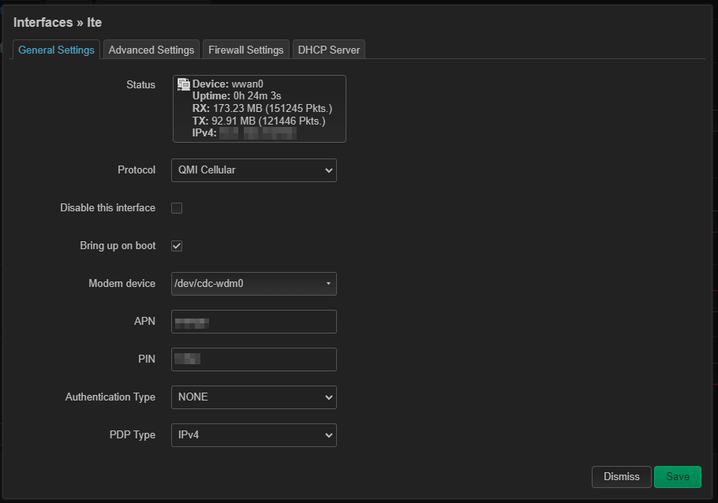
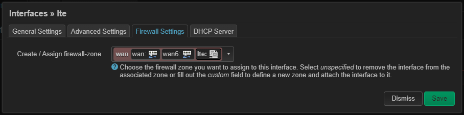

# OpenWRT + LTE

## Prerequisites

You will need to be able to connect to openwrt on SSH.
OpenWRT device will need to access to internet. To do so you can plug the WAN port to a router.

## Install Addon

First go to [here](https://github.com/mrhaav/openwrt) and download the latest `uqmi_<xxxxxxxxx>_mipsel_24kc.ipk` package.

SSH to openwrt, transfert the file and install.

```bash
opkg install uqmi_<xxxxxxxxx>_mipsel_24kc.ipk
```

## Install LTE

### QMI
```bash
opkg update
opkg install kmod-usb-net-qmi-wwan uqmi luci-proto-qmi kmod-usb-serial-option picocom
reboot
```

### MBIM
```bash
opkg update
opkg install kmod-usb-net-cdc-mbim umbim luci-proto-mbim kmod-usb-serial-option picocom
reboot
```

## Verify

```bash
ls -l /dev/cdc-wdm0
```

> crw-r--r--    1 root     root      180, 176 Oct  1 12:03 /dev/cdc-wdm0

## Create LTE interface

If the package luci-proto-qmi is installed, navigate to Network => Interfaces, then Add new interface => Protocol: QMI Cellular, Interface: `cdc-wdm0`

Alternatively, select `Protocol: MBIM Cellular` if MBIM is in use.

Example


Then associate lte interface to firewall zone


## Signal LED

Install nano and create the script
```bash
opkg install nano
nano /etc/ledltesignal.sh
```

Script content
```bash
#!/bin/sh

os=-1
while true; do
  rssi=$(uqmi -d /dev/cdc-wdm0 -t 1000 -s --get-signal-info | jsonfilter -e '@["rssi"]')
  
  if [ -z $rssi ] || [ $rssi -ge 0 ]; then s=0;
  elif [ $rssi -ge -65 ]; then s=3;
  elif [ $rssi -ge -75 ]; then s=2;
  elif [ $rssi -ge -85 ]; then s=1;
  else s=0;
  fi
  
  if [ $os != $s ]; then
    case $s in
      0) 
         echo 0 > /sys/class/leds/white:signal1/brightness
         echo 0 > /sys/class/leds/white:signal2/brightness
         echo 0 > /sys/class/leds/white:signal3/brightness
      ;;
      1)
         echo 255 > /sys/class/leds/white:signal1/brightness
         echo 0 > /sys/class/leds/white:signal2/brightness
         echo 0 > /sys/class/leds/white:signal3/brightness
      ;;
      2)
         echo 255 > /sys/class/leds/white:signal1/brightness
         echo 255 > /sys/class/leds/white:signal2/brightness
         echo 0 > /sys/class/leds/white:signal3/brightness
      ;;
      3)
         echo 255 > /sys/class/leds/white:signal1/brightness
         echo 255 > /sys/class/leds/white:signal2/brightness
         echo 255 > /sys/class/leds/white:signal3/brightness
      ;;
    esac
    os=$s
  fi
  sleep 5
done

exit
```

Add execute permission
```bash
chmod 750 /etc/ledltesignal.sh
```

Edit rc.local
```bash
nano /etc/rc.local
```

Add the script exec
```bash
# Put your custom commands here that should be executed once
# the system init finished. By default this file does nothing.

/etc/ledltesignal.sh &

exit 0
```

## DDNS (dynamic dns)

### Install Prerequisit for DDNS

Install package
```bash
opkg update
opkg install ddns-scripts ddns-scripts-gandi ddns-scripts-services ddns-scripts-utils curl ca-bundle
```

### Configure DDNS

Edit ddns
```bash
nano /etc/config/ddns
```

```bash
config ddns 'global'
        option ddns_dateformat '%F %R'
        option ddns_loglines '250'
        option upd_privateip '0'

config service 'gandi'
        option enabled '1'
        option service_name 'gandi.net'
        option domain 'xxxxx.yy'
        option username 'subdomain_value'
        option password 'XXXXXXXXXXXXXXXXXXXX'
        option interface 'wwan0'
        option ip_network 'wwan0'
        option ip_source 'web'
        option ip_url 'http://checkip.dyndns.org/'
        option use_https '1'
        option cacert '/etc/ssl/certs/ca-certificates.crt'
        option check_interval 10
        option lookup_host 'subdomain_value.xxxxx.yy'
```

### Testing

```bash
/usr/lib/ddns/dynamic_dns_updater.sh -n gandi -v2 start
```

### Restart service

```bash
service ddns restart
```

### More info

https://openwrt.org/docs/guide-user/services/ddns/client


# Sources

https://openwrt.org/docs/guide-user/network/wan/wwan/ltedongle

https://github.com/mrhaav/openwrt

https://forum.openwrt.org/t/tp-link-tl-mr6400-v5-2-lte-configuration/123603

https://forum.openwrt.org/t/lte-not-working-with-tl-mr6400-v5-3/156884

